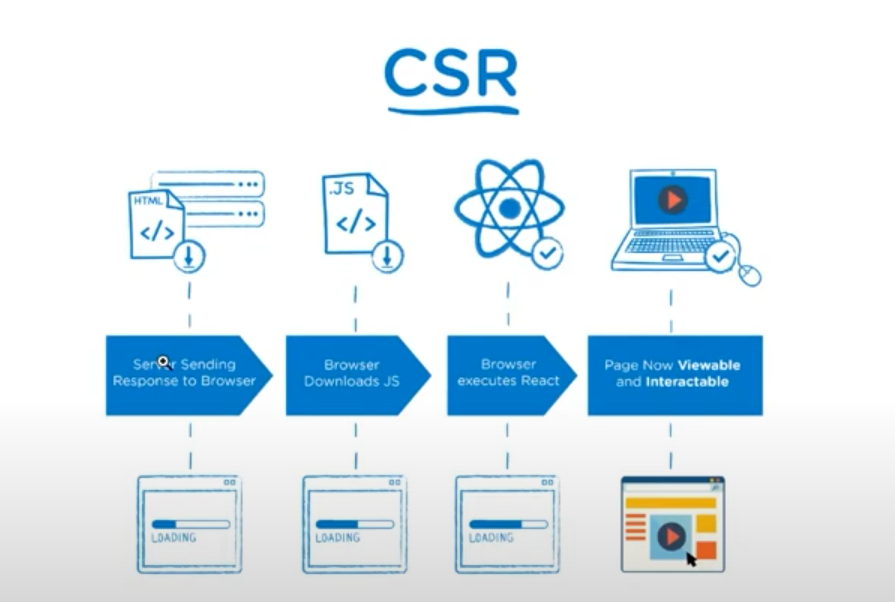
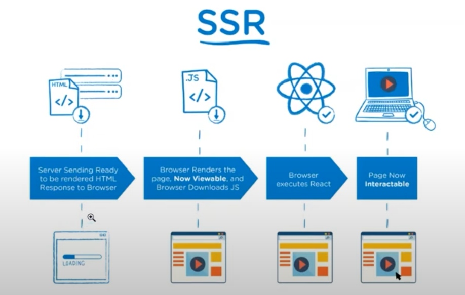
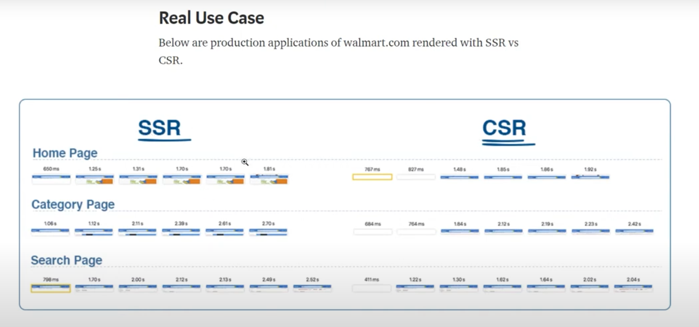

## Getting Started

First, run the development server:

```bash
npm run dev
# or
yarn dev
```

## structure folder

### modules

- server
  - data
    - products.json

### pages

- api
  - product
    - [id].js
  - hello.js
  - products.js
- index.js

### public

- favicon.ico
- vercel.svg

Next Version: 9.4

##### Apa yang akan kamu pelajari dari app ini?

- SSR(SERVER SIDE RENDERING), CSR(CLIENT SIDE RENDERING)
- CSR(CLIENT SIDE RENDERING)
  -- 
- SSR(SERVER SIDE RENDERING)
  -- 
  -- Use Case
  -- 
- SSG(STATIC SIDE GENERATOR)
- Material UI
- Pre-rendering Nextjs
- Static Generation with data
- JSSS (JavaScript Style Sheets)
- Absolute Path
